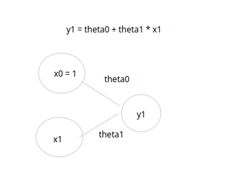

# Linear regression với pytorch

## Dữ liệu
- Mô hình sẽ đạt được: Y = aX + b
- X = [3, 4, 5, 6, 7, 8, 9, 10]
- Y = [7.7, 7, 6.5, 6, 5.2, 5, 4.3, 3.8]

## Hiện thực

- Tạo mô hình NN mới với Pytorch:
  - Yêu cầu tất cả các mô hình mới từ pytorch phải kế thừa từ torch.nn.Module
- Sừ dụng hàm loss là MSE
- Tối ưu loss function bằng Stochastic Gradient Descent

