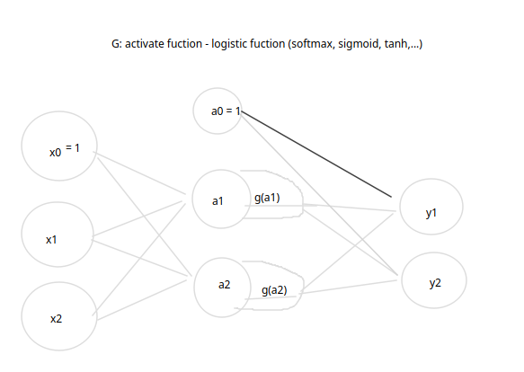
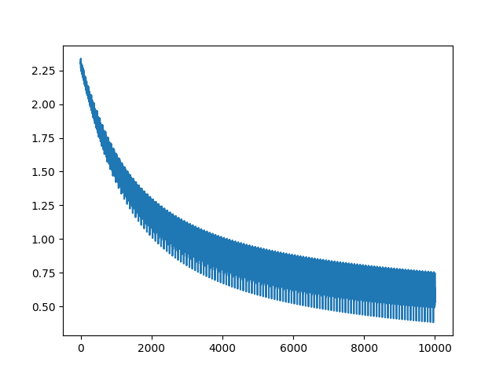

# Logistic regression với pytorch

linear regression + logistic function activation(softmax) = logistic regression

## Dữ liệu:
Dữ liệu số viết tay MNIST:
- 42k dòng dữ liệu
- 28 * 28 = 784 thuộc tính ở dạng số thể hiện giá trị ở pixel
- nhãn đầu ra là số từ 0 ... 9

## Hiện thực:

- Xây dựng mô hình logistic regression với softmax function làm activate
- cross entropy loss function
  

- Tối ưu với Stochastic Gradient Descent

